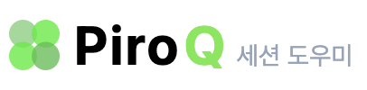
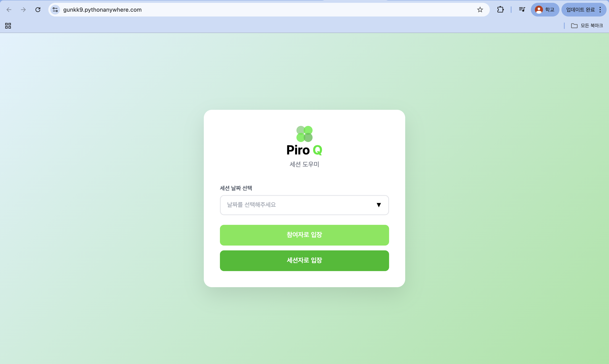
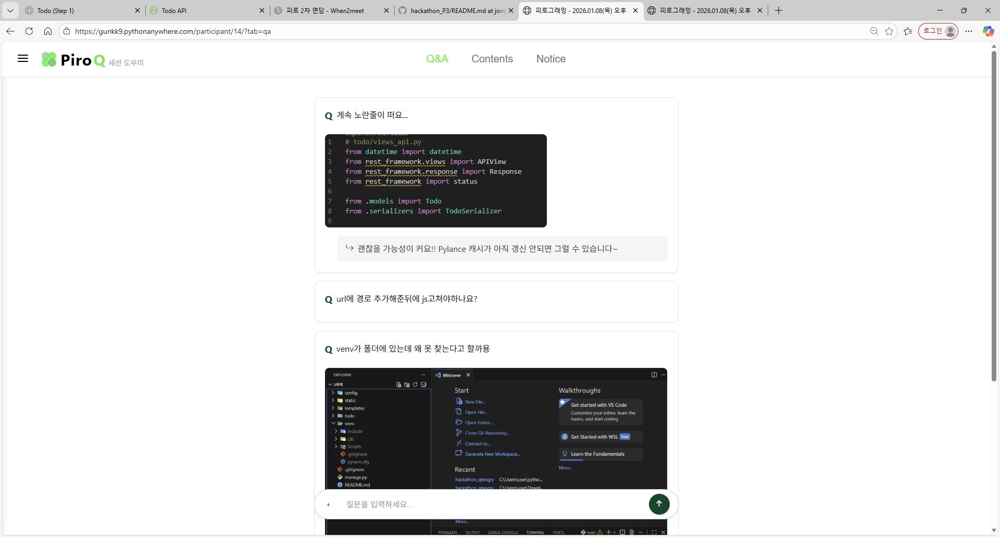
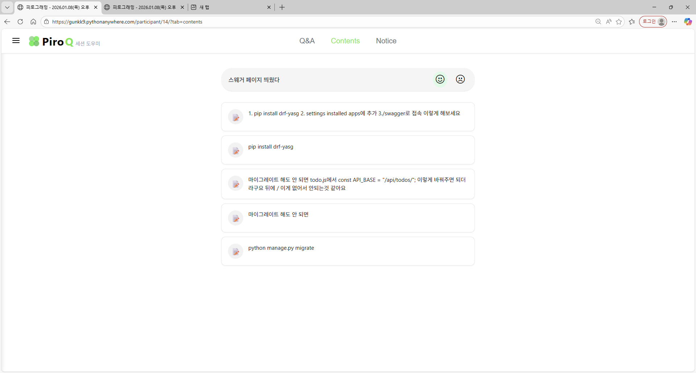
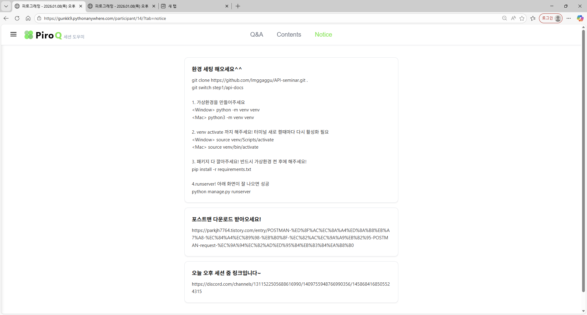

# 🎓 피로그래밍 세션 도우미
**🏆 피로그래밍 해커톤 P3조 프로젝트**

개발 기간 : 2025.01.04. ~ 01.06. (3일)

<br>

> **피로그래밍 세션을 더 효율적으로 운영할 수 있도록 돕는 웹서비스입니다!**

카카오톡으로 진도 체크하고, 질문은 채팅방에서 금방 밀려나고... 매번 줌 링크와 노션 링크를 찾아 헤매던 경험, 다들 있으시죠? 이런 불편함을 해결하고자 탄생한 **피로그래밍 세션 도우미**. 실시간 진도 체크와 질문 관리, 그리고 체계적인 자료 공유를 통해 더욱 효율적인 세션을 만들어가요!
<br>

<div align="center">
  
| **서비스 로고** | **메인 화면** |
| :------: |  :------: |
|  | ![세션] (./assets/images/session.png) |

</div>

<br>

### **배포 URL : [진행중...]**

<br>
<br>

# 📌 목차
- [💪🏻 팀원 구성](#-팀원-구성)
- [🛠 기술 스택](#-기술-스택)
- [🏗 시스템 아키텍처](#-시스템-아키텍처)
- [✨ 주요 기능](#-주요-기능)
- [📱 서비스 화면](#-서비스-화면)

<br>

# 💪🏻 팀원 구성

<div align="center">

| **김경원** | **백종현** | **장민지** | **박서윤** | **박민욱** |
| :------: |  :------: | :------: | :------: | :------: |
| BE | BE | BE | FE | FE |

</div>
<br>

# 🛠 기술 스택

### Stacks
<div align="center">
  
| 구분 | Stack  |
| :------: |  :------: |
| **FE** |    |
| **BE** |    |

</div>
<br>

### Tools
<div align="center">
  
 

</div>

### Collaboration
<div align="center">

  

</div>

<br>

# 🏗 시스템 아키텍처
```
hackathon_P3/
├── config/              # Django 설정
├── piro_sessions/       # 세션 관리 앱
├── qna/                 # Q&A 관리 앱
├── piro_contents/       # 콘텐츠/진도 관리 앱
├── notices/             # 공지사항 관리 앱
├── templates/           # HTML 템플릿
├── static/             # CSS, JavaScript
└── media/              # 업로드 파일
```

<br>

# ✨ 주요 기능

### 1. 👥 참여자 / 세션자 역할 분리
- 초기 화면에서 **참여자** 또는 **세션자** 역할 선택
- 역할에 따라 다른 권한과 UI 제공
- 세션 날짜별로 독립적인 페이지 관리

### 2. 📊 실시간 진도 체크
- 참여자: 😊(이해함) / 😢(어려움) 이모지로 진도 표시
- 세션자: 실시간으로 참여자들의 진도 통계 확인
- 사용자별 한 번만 체크 가능 (변경 가능)
- 쿠키 기반 사용자 식별로 로그인 없이 사용 가능

### 3. 💬 Q&A 시스템
- 참여자: 익명으로 질문 작성 (이미지 첨부 가능)
- 세션자: 질문에 대한 답변 작성
- 질문 카드 클릭으로 간편한 답변 작성
- 체크/엑스 아이콘으로 답변 완료 상태 토글
- 최신 질문이 위로 오도록 정렬

### 4. 📚 콘텐츠 관리
- 세션자: 강의 자료 업로드 (링크, 파일, 이미지, 텍스트)
- 진도 체크 박스 동적 생성
- 파일 타입 자동 감지 (이미지/일반 파일)
- 최신 자료가 위로 오도록 정렬

### 5. 📢 공지사항
- 세션자: 줌 링크, 노션 링크 등 공지사항 작성
- 파일 첨부 지원 (이미지는 미리보기, 파일은 다운로드)
- 제목과 내용으로 구조화된 공지

### 6. 🔄 사이드바 세션 전환
- 햄버거 메뉴로 사이드바 열기
- 다른 세션 날짜로 빠르게 이동
- 현재 탭 상태 유지하면서 세션 변경
- 스크롤 가능한 세션 목록

<br>

# 📱 서비스 화면

### 초기 화면
* 세션 날짜를 드롭다운에서 선택합니다.
* **참여자** 또는 **세션자** 역할을 선택하여 입장합니다.

| **초기 화면** |
| :------: |
|  |

<br>

### Q&A 페이지
* **참여자**: 질문 작성 및 이미지 첨부, 진도 체크 (😊/😢)
* **세션자**: 질문 목록 확인, 답변 작성, 진도 통계 확인

| **참여자 Q&A** | **세션자 Q&A** |
| :------: | :------: |
|  | 📸 스크린샷 |

<br>

### Contents 페이지
* **참여자**: 업로드된 자료 확인, 진도 체크
* **세션자**: 자료 업로드, 진도 체크 박스 생성, 진도 통계 확인

| **참여자 Contents** | **세션자 Contents** |
| :------: | :------: |
|  | 📸 스크린샷 |

<br>

### Notice 페이지
* **참여자**: 공지사항 확인
* **세션자**: 공지사항 작성 및 파일 첨부

| **참여자 Notice** | **세션자 Notice** |
| :------: | :------: |
|  | 📸 스크린샷 |

<br>

### 사이드바
* 세션 목록을 스크롤하여 확인
* 다른 세션으로 빠르게 이동
* 초기 화면으로 복귀

| **사이드바** |
| :------: |
| 📸 스크린샷 |

<br>

# 🚀 설치 및 실행
```bash
# 저장소 클론
git clone [repository-url]
cd hackathon_P3

# 가상환경 생성 및 활성화
python -m venv venv
source venv/bin/activate  # Windows: venv\Scripts\activate

# 패키지 설치
pip install django pillow

# 마이그레이션
python manage.py makemigrations
python manage.py migrate

# 초기 데이터 생성
python manage.py create_initial_data

# 서버 실행
python manage.py runserver
```

브라우저에서 `http://127.0.0.1:8000/` 접속

<br>

# 📝 프로젝트 특징

### ✅ 협업 중심 설계
- **4개의 앱으로 모듈화**: 각 팀원이 독립적으로 작업 가능
- **명확한 역할 분담**: 세션/Q&A/콘텐츠/공지사항
- **컴포넌트 기반 템플릿**: 재사용 가능한 HTML 컴포넌트

### ✅ 사용자 경험 중심
- **로그인 불필요**: 쿠키 기반 사용자 식별
- **직관적인 UI**: 이모지와 아이콘으로 간단한 조작
- **실시간 피드백**: 애니메이션과 상태 변경

### ✅ 확장 가능한 구조
- **Django ORM**: 데이터베이스 독립적
- **모듈화된 앱 구조**: 새로운 기능 추가 용이
- **정적 파일 분리**: CSS/JS 파일 독립 관리

<br>

# 🔧 향후 개선 계획
- [ ] 실시간 알림 기능 (WebSocket)
- [ ] 사용자 인증 시스템 추가
- [ ] 세션 통계 대시보드
- [ ] 모바일 반응형 UI 개선
- [ ] 배포 및 도메인 연결

<br>

---

<div align="center">

*피로그래밍 24기 해커톤 2025*

</div>